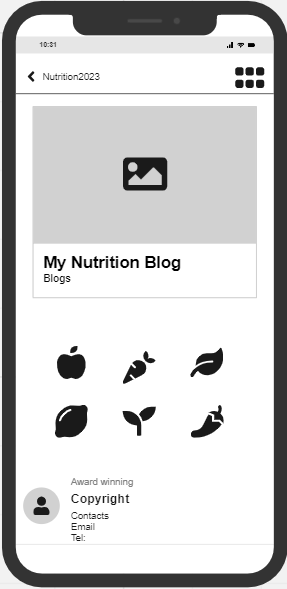
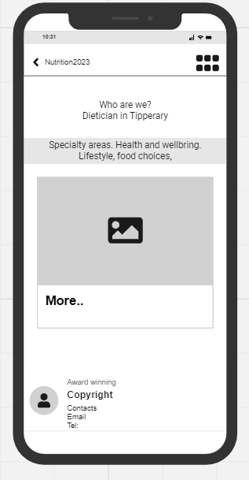
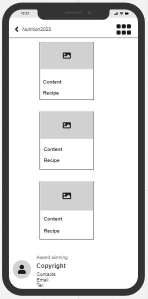
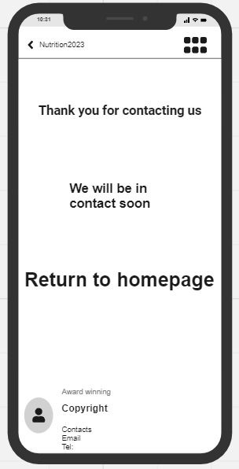
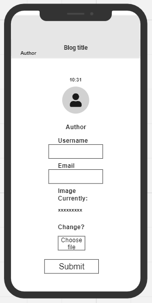
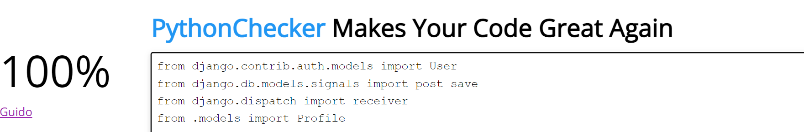
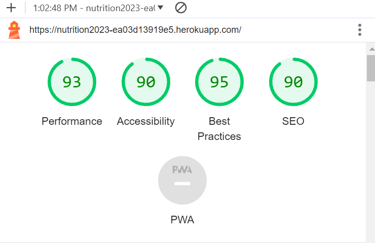
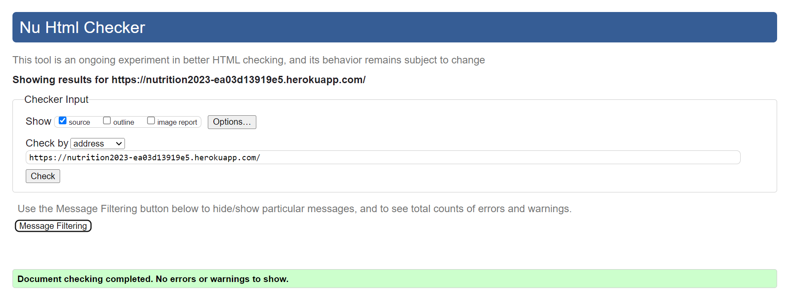
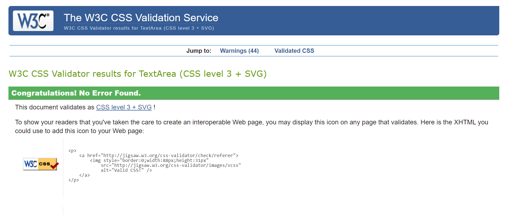

# Nurtition 2023 - Nutrition Blog

## Table of Contents

- [Overview](#overview)
- [User Experience](#ux)
- [Project Goal](#project-goal)
- [Design](#design)
  - [Colour Scheme](#colour-scheme)
- [Skeleton](#skeleton)
  - [Wireframes](#wireframes)
  - [Flowchart](#flowchart)
  - [Visual Effects](#visual-effects)
- [Features](#features)
  - [Visual Effects](#visual-effects)
  - [Home Page](#home-page)
  - [About Us Page](#about-us-page)
  - [Blogs Page](#blogs-page)
  - [Comments Page](#comments-page)
  - [Recipes Page](#recipes-page)
  - [Add Recipe Modal](#add-recipe-modal)
  - [Contact Page](#contact-page)
  - [Account Login](#account-login)
  - [Register](#register)
  - [Profile](#profile)
  - [Logout](#logout)
- [Agile Methodology](#agile-methodology)
  - [Responsive Layout and Design](#responsive-layout-and-design)
  - [Database](#database)
- [Testing](#testing)
  - [Lighthouse](#lighthouse)
  - [HTML Validation](#html-validation)
  - [CSS Validation](#css-validation)
  - [Manual Testing](#manual-testing)
  - [Frontend](#frontend)
  - [Backend Admin Panel](#backend-admin-panel)
  - [Manual Testing](#manual-testing)

## Overview

This is a project designed and developed to create a friendly atmosphere for those looking to talk nutrition, providing clients with professional, evidence-based nutrition support that they can implement easily, to make long term sustainable changes. It allows the user to learn from professionals as well as gain ideas, tips and support from other users. There is a recipes section where the user can learn how to make simple, quick and healthy snacks and meals with simple ingredients and step by step methods. 

**Nurtition 2023** - Nutrition Blog was developed using Python (Django), HTML, CSS and JavaScript by storing the data in a PostgreSQL database.
  
The fully deployed project can be accessed at [this link](https://nutrition2023-ea03d13919e5.herokuapp.com/).  

[Back to Table of Contents](#table-of-contents)

# UX
This website was created using the Five Planes Of Website Design 

**User Stories**

User stories can be viewed here on the project [kanban board ](https://github.com/users/hughes84/projects/1)

|   EPIC                                |ID|                                User Story                                                   |
| :-------------------------------------|--|:------------------------------------------------------------------------------------------- |
|**CONTENT AND NAVIGATION**             |  ||
|                                       |1A| As a user, I want to see a menu so I can easily navigate through website content |             
|                                       |1B| As a user, I want to know what the website is about without having to do too much reading|
|                                       |1C| As a user, I want the website to have a nice and intuitive design that will match the blog's theme|
|**USER REGISTRATION**                  |  || 
|                                       |2A| As a user, I want to be able to register on the website|
|                                       |2B| As a user, I want to be able to authenticate using only email and password|
|                                       |2C| As a user, I want to be able to log out at any time|
|                                       |2D| As a user, I want to know that I've logged out successfully|
|**BLOGS**                              |  ||
|                                       |3A| As a logged-in user, I want to be able to see relevant blogs clearly|
|                                       |3B| As a logged-in user, I want to be able to select a blog and comment and/or like selected blog|
|                                       |3C| As a logged-in user, I want to be able to delete my own previous comments|
|**RECIPES**                            |  ||
|                                       |4A| As a user, I want to see the recipes individual overview clearly|
|                                       |4B| As a user, I want to be able to access ingredients and methods|
|                                       |4C| As a logged-in user, I want to be able to navigate through different recipes easily|
|**ADMINISTRATION**                     |  ||
|                                       |5A| As a logged-in admin member, I want to be able to access the admin page|
|                                       |5B| As a logged-in admin member, I want to be able to authenticate and authorise comments and posts|
|                                       |5C| As a logged-in admin member, I want to be able to publish new recipes|
|                                       |5D| As a logged-in admin member, I want to be able to create a new user, recipes, author and categories|
|                                       |5E| As a logged-in admin member, I want to be able to delete users, recipes, authors, categories and comments|
|**CONTACT**                            |  ||
|                                       |6A| As a user, I want to be able to contact the site with ease|
|                                       |6B| As a user, I want to get a reply that my messgae has been received|
|                                       |6C| As a user, I want to see contact information on the website|

[Back to Table of Contents](#table-of-contents)

# Project Goal:

To create a blog for those with an interest in nutrition, seeking guidance, information tips or discuss their own experiences and ideas with others and staff members as well.

**Project Objectives:**

* To create a website with a simple and intuitive User Experience;
* To add content that is relevant to the topic and helps create a better understanding;
* To be able to differentiate between client and staff member accounts;
* To implement fully functional features that will ease the staff members' tasks and upgrade clients' experience with the blog features;
* To make the website responsive and functional on different devices.  

[Back to Table of Contents](#table-of-contents)

# Design

#### Colours

* The colour scheme is kept simple by opting mainly for a combination of white text set against the dark backgrounds and black text against the white backgrounds. For the navbar, I selected a bright colour from Bootstrap to highlight the site name as well as encouraging the surrounding colours. The social links and nav bar selections change colour when hovered over to highlight selection. The footer follows suit with this method. Throughout the site the user will see bright, welcoming colours like this when hovering over certain sections as well as colourful buttons on each page.

## Colour Scheme
* The primary colour scheme was used for body, headers and nav elements  

 

* The secondary colour scheme was used for buttons, warnings, errors or for highlighting important information. 

[Back to Table of Contents](#table-of-contents)

#### Typography

* The Roboto font is used as the main font for the whole project.

[Back to Table of Contents](#table-of-contents)

#### Imagery

* All images on the site are related to the recipes, blogs and website design. There are 3 static images throughout the site. The remaining images will be uploaded by the author to the database.

# Skeleton

## Wireframes
The wireframes for mobile were created with [Miro]() tool and can be viewed below: 

  
Wire Frames

  <h4>Home page</h4>
   
  <h4>About page</h4>
   
  <h4>About more</h4>
   
  <h4>Blog page</h4>
   
  <h4>Blog user comments</h4>
   
  <h4>Recipes</h4>
   
  <h4>Recipe details</h4>
   
  <h4>Contact us</h4>
   
  <h4>Submit message</h4>
   
  <h4>User profile</h4>
   
  <h4>Sign in</h4>
   
  <h4>Sign up</h4>
   

 

[Back to Table of Contents](#table-of-contents)

## Flowchart

The Flowchart for my program was created using <b>[draw.io](https://app.diagrams.net/)</b> and it visually represents how the system works. 
 
  

## Visual Effects

* **Box shadows**  
Multiple box shadows were used for the cover, buttons and images.  
* **Animation** 
Some animations were used for creating a dynamic and attractive design

## Features

### Home Page

* The hero image welcomes the user with a short message advertising what the website is about. There is a nutrition 
themed image in the background and a button that takes the user straight to the blogs page. 

### About Us Page

* The About Us page explains about who we are, giving a brief description of a dietician in Co. Tipperary. The user is given the option of learning more by pressing a button below, where they are lead to a new screen with more content.

[Back to Table of Contents](#table-of-contents)

### Blogs Page

* In the blogs scetion, the user can see a selection of six different blog topics, with user friendly images. There are buttons again below these images inviting the user to read more where they will be lead to a new screen with more on each blog. Here the user can add their own comment, edit it and delete it.

[Back to Table of Contents](#table-of-contents)

### Comments Page

* Note: The user can only edit and delete their own comments and must be logged in to do so.

[Back to Table of Contents](#table-of-contents)

### Recipes Page

* On out recipe page the user is met with some appealing images of healthy foods. There is a small snippet of info about each recipe and the user is invited to press the recipe button below each image where they are brought to a new screen with some detailed ingredients and method on their chosen recipe.

[Back to Table of Contents](#table-of-contents)

### Add Recipe Modal

* On the bottom right of the recipe page the user will see an + add recipe button where they will be brought to a modal allowing them to add their own recipes which will then be added to the recipes page.

[Back to Table of Contents](#table-of-contents)

### Contact Page

* The contact page gives the user the option to contact the website admin by filling out a simple form. They must input their name, a valid email and a brief message before submitting. This will then redirect the user to a new screen and thank you message. An email is then sent to the admin.

[Back to Table of Contents](#table-of-contents)

### Account login

* When the user presses account on the navbar they will be given options of login or register and profile or logout, depending on their status. 
The login page requests a username and password and also has a forgot password option which will send an email to users email address.

[Back to Table of Contents](#table-of-contents)

### Register

* The registration page promts the user to register their account. They are asked to enter a username, email, password and repeat password. There are criteria to the password which must be met or an error message pops up.

[Back to Table of Contents](#table-of-contents)

### Profile

* The profile page allows the user to add an image as well as edit their profile picture, username or email address.

[Back to Table of Contents](#table-of-contents)

### Logout

* If the user wishes to logout they are brought to a new screen where they are asked if they are sure they want to sign out. There is a button to reconfirm which then leads back to the home screen. 
On this page you can clearly see the footer which is available on every page.

[Back to Table of Contents](#table-of-contents)

## Database

The project uses the PostgreSQL relational database for storing the data.

## Agile Methodology
This project was developed using the Agile methodology. 
All epics and user stories implementation progress was registered using [Github issues](https://github.com/hughes84/my-blog-pp4/issues). As the user stories were accomplished, they were moved in the Kanban Board from **Epic**,**User stories**, **To Do**, to **In-progress**, **Testing** and **Done** lists. 

## Responsive Layout and Design
The project design has been adapted to all types of devices using Bootstrap predefined breakpoints. For intermediate devices where the design didn't fit accordingly, custom breakpoints were used.

**Breakpoints:**
    - max-width:575.98px
    - max-width:991.98px
    - max-width:1300.98px

[Back to Table of Contents](#table-of-contents)

## Tools Used

[GitHub](https://github.com/) - used for hosting the source code of the program 
[Visual Studio](https://code.visualstudio.com/) - for writing and testing the code 
[Heroku](https://dashboard.heroku.com/) - used for deploying the project 
[Miro](https://miro.com/) - for creating the wireframes 
[Draw.io](http://draw.io/) - used for creating the Flowchart and Database relational schema 
[Favicon.io](https://favicon.io/) - used for generating the website favicon 
[Font Awesome](https://fontawesome.com/) - for creating atractive UX with icons 
[Bootstrap5](https://getbootstrap.com/) - for adding predifined styled elements and creating responsiveness 
[Google Fonts](https://fonts.google.com/) - for typography 
[JsHint](https://jshint.com/) - used for validating the javascript code 
[PEP8 Validator](http://pep8online.com/) - used for validating the python code 
[HTML - W3C HTML Validator](https://validator.w3.org/#validate_by_uri+with_options) - used for validating the HTML 
[CSS - Jigsaw CSS Validator](https://jigsaw.w3.org/css-validator/#validate_by_uri) - used for validating the CSS 
[ElephantSQL](https://www.elephantsql.com/) - for storing static data 
LightHouse - for testing performance 

[Back to Table of Contents](#table-of-contents)

# Testing

* Testing has taken place continuously throughout the development of the project. Each view was tested regularly. 
  When the outcome was not as expected, debugging took place at that point.

  ### Python Validation - PEP8
* Python testing was done using the PEP8 Online to ensure there were no syntax errors in the project. All python files
were entered into the online checker and no errors were found in any of the custom codes.

## Lighthouse
Lighthouse was used to test Performance, Best Practices, Accessibility and SEO on Desktop.

[Back to Table of Contents](#table-of-contents)

## HTML Validation

## CSS Validation
* Custom CSS was validated using W3C Jigsaw validation service. No were displayed.

[Back to Table of Contents](#table-of-contents)

## Manual Testing
### Frontend
* The Signup, Login and Logout system has no issues and is working correctly. All interactive messages to the users displayed appropriately.
* The Profile Page is working properly. It updates the user information and uploads/updates the 
user profile image. It shows the interactive message to the user once the update is complete. A realtime clock is also displayed and working correctly.
* All the internal links are working and bring the user to the right page on the website.
* All the external links are working and bring the user to the right social media page by opening a new browser tab.
* The recipes page shows the recipes seperately without issues.
* When the user is posting a new recipe all the required fields have to be filled otherwise the author cannot submit the post to the database.
* The drop-down menu in the navbar shows a list for account options.
* The contact form on the Contact Page is working without any errors.  It sends an email, 
to the admin, once the user fills in the form and clicks on the submit button. 
A messages for email success is displayed on the screen.
* On the Post Details Page, the Like/unlike functionality is working without issues.
* The comment form has no issues and it submits a new comment once the form is completed by a
registered user. 
The comment is displayed once the submit button is pressed. The two interactive messages for 
this action are working without errors. 
* The functionality to delete or edit a comment is working correctly. The user can only delete their own comment and must be logged in to do so.  

[Back to Table of Contents](#table-of-contents)

### Backend Admin Panel
* I have tested the Admin Panel repeatedly since the start of the project development. All the models are working without issues.  
I have created, deleted, and updated data in all models without errors. The models have the behavior expected for what they were built for.

[Back to Table of Contents](#table-of-contents)